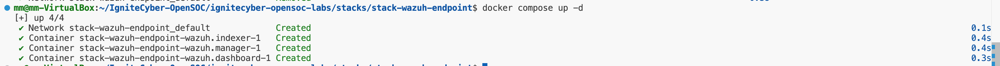

# 1) Ollama and Jupterlab installation

Prerequisites
1) VM Requirements

Docker Engine installed

Docker Compose v2 available

Enough disk space for models (recommend 30–60GB free minimum)

Check:

docker --version
docker compose version
df -h

2) Repo + Environment File

From from the docker folder :

cp .env.example ai/.env

Recommended .env defaults:

OPENSOC_NETWORK=ignitecyber

OLLAMA_BIND=127.0.0.1
OLLAMA_PORT=11434

JUPYTER_BIND=127.0.0.1
JUPYTER_PORT=8888
JUPYTER_TOKEN=ignitecyber

Network Setup (One-Time)

The AI compose expects an external Docker network (default: ignitecyber).

Check/create:

docker network ls | grep ignitecyber || docker network create ignitecyber

If your baseline stack uses a different network name, set it in .env:

OPENSOC_NETWORK=<your_network_name>

Start the AI Profile

From repo root:

docker compose -f docker/ai/docker-compose.ai.yml --profile ai up -d --build


Verify containers are running:

docker ps --format "table {{.Names}}\t{{.Status}}\t{{.Ports}}"

✅ Pass criteria

opensoc-ollama is Up

opensoc-jupyterlab is Up

Ports are bound to localhost:

127.0.0.1:11434 (Ollama)

127.0.0.1:8888 (JupyterLab)

Pull Standard Models

Make scripts executable (first time only):

chmod +x docker/ai/scripts/*.sh

Pull the standard model set:

./docker/ai/scripts/pull-models.sh

✅ Pass criteria

ollama list shows the pulled models

No errors during pulls

If disk is limited, pull fewer models first (start with llama3.2:3b).

Run a Smoke Test (Ollama API)
./docker/ai/scripts/smoke-test.sh


✅ Pass criteria

/api/tags returns a model list

A non-empty response is returned for the prompt

Validate JupyterLab
1) Open JupyterLab

From the VM browser (or port-forwarded on your host):

http://127.0.0.1:8888

Token (default):

ignitecyber (or whatever you set in .env)

2) Notebook Test (Copy/Paste)

Create a new notebook and run:

import os, requests

base = os.environ.get("OLLAMA_BASE_URL", "http://127.0.0.1:11434")

r = requests.post(f"{base}/api/generate", json={
  "model": "llama3.2:3b",
  "prompt": "Return a JSON object with keys: risk, summary. Scenario: suspicious PowerShell encoded command.",
  "stream": False
})

print(r.status_code)
print(r.json()["response"])

✅ Pass criteria

Status code is 200

Response prints successfully

Stability & Performance Checks
1) Basic Resource Snapshot
docker stats --no-stream

2) Repeat Prompt Test (10 Runs)
for i in {1..10}; do ./docker/ai/scripts/smoke-test.sh >/tmp/ai_test_$i.txt; done


✅ Pass criteria

No container restarts

No timeouts/errors across 10 runs

Stop the AI Profile
docker compose -f docker/ai/docker-compose.ai.yml --profile ai down


This stops only the AI profile containers defined in the AI compose file.

Troubleshooting
View Logs

Ollama:

docker logs opensoc-ollama --tail 200


JupyterLab:

docker logs opensoc-jupyterlab --tail 200

Common Issues

1) Port already in use

Change OLLAMA_PORT or JUPYTER_PORT in .env

Re-run up -d

2) “No space left on device” during model pulls

Remove unused Docker artifacts:

docker system prune -af


Pull fewer models (start with llama3.2:3b)

3) Jupyter doesn’t start

Check logs and confirm Dockerfile/requirements build successfully:

docker compose -f docker/ai/docker-compose.ai.yml --profile ai up -d --build
docker logs opensoc-jupyterlab --tail 200

Recommended Standard Models (Baseline)

Suggested starter pack:

llama3.2:3b (fast + general)

qwen2.5:7b-instruct (quality + multilingual)

qwen2.5-coder:7b-instruct (coding + detections)

phi3.5:mini (lightweight backup)

Notes

Do not commit .env (it should be gitignored).

Do not commit Ollama model blobs (stored in Docker volume ollama_models).

If you hit blockers, capture:

docker ps

docker logs opensoc-ollama --tail 200

docker logs opensoc-jupyterlab --tail 200


# 2) The Case-Intel stack Installlation:

### Hive-Cortex and MISP Setup Guide

Navigate to the `hive-cortex` directory:

```bash
cd hive-cortex
```

Run the initialization script:

```bash
bash ./scripts/init.sh
```

Start the containers:

```bash
docker compose up -d
```

Verify the containers are running:

```bash
docker compose ps
```

Reference Image:


If you receive a permission denied error, run:

```bash
sudo chown root:docker /var/run/docker.sock && sudo chmod 660 /var/run/docker.sock
```

Then retry:

```bash
docker compose ps
```

If docker container for elssticsearch or cassandra fails:

```bash
sudo chown -R 1000:1000 .
sudo chmod -R 775 .
```

Then retry creating the containers


---

Navigate to the `misp-docker` directory:

```bash
cd misp-docker
```

Create the .env file:

```bash
cp template.env .env
```

Start the containers:

```bash
docker compose up -d
```

Reference Images:


---

To access the web endpoints from your host machine, update the `/etc/hosts` file:

```bash
sudo nano /etc/hosts
```

Add the following line:

```
[VM_IP]    soc.lab
```

Replace `[VM_IP]` with your virtual machine’s IP address.

---

To access the web endpoints from your VM, update the `/etc/hosts` file:

```bash
sudo nano /etc/hosts
```

Add the following line:

```
127.0.0.1    soc.lab
```

---

#### Service URLs and Credentials

**TheHive**

- URL: http://soc.lab:9000/thehive  
- Username: admin@thehive.local  
- Password: secret  

**Cortex**

- URL: http://soc.lab:9001/cortex  
- Username: admin  
- Password: password  
(Cortex does not have default password. Accessing it for the first time might lead to the "Update Database" page. By clicking on it a user and password can be created)

**MISP**

- URL: https://soc.lab:8443/  
- Username: admin@admin.test  
- Password: admin 

---

#### Service Connections


**TheHive-Cortex Connection**

1. Create an organization IC_SOC in Cortex:


2. Create a user for the organization:

Copy this user's API key in TheHive for the Cortex server connection in step 4


3. Create the same organization in TheHive:


4. In TheHive's Platform-Management, go to the Connector tab and add a Cortex server with the following config:


5. Test the connection. Once the connection is working, click on update and then click on confirm to save the changes.


**TheHive-MISP Connection**

1. In MISP go to My Profile and Auth keys and create a new auth key for the user:
Make sure to copy the key.


2. In Theive's Platform-Management, go to the Connector tab and add a MISP server with the following config and the API key from step 1:


3. Test the connection. Once the connection is working, click on update and then click on confirm to save the changes.


**TheHive Case Ingestion**

1. In TheHive, go to Admin → Organisations, open your org, and click Add User. Fill in login, name, and set the role to analyst or org-admin. Set a password and save.

2. Go to Admin → Users, open the user → API Key → Create → Reveal. Copy the key.


3. Use the org user's API key — the platform admin key cannot create cases.

```bash
export THEHIVE_URL="http://<host>:9000/thehive"
export THEHIVE_API_KEY="your-api-key-here"
```
In the IgniteCyber_Notebooks_Pack_v1.2/ignitecyber_TheHive_CaseImport_Workflow_LAB2_v1.1/ folder run:

```bash
python3 import_casebundle.py casebundle_lab2_1.json
python3 import_casebundle.py casebundle_lab2_2.json
```bash

# 3) Wazuh Stack Installation

In the `stack-wazuh-endpoint` directory, generate the certificates using the command:

```bash
docker compose -f generate-indexer-certs.yml run --rm generator
```

Start the containers:

```bash
docker compose up -d
```

Reference Image:


---

#### Service URLs and Credentials

**Wazuh**

- URL: https://soc.lab:5601
- Username: admin 
- Password: SecretPassword  

Installing the wazuh-agent:

In the `stack-wazuh-endpoint` directory, generate the certificates using the command:

```bash
docker compose -f generate-indexer-certs.yml run --rm generator
```

Start the containers:

```bash
docker compose up -d
```

Reference Image:


---

#### Service URLs and Credentials

**Wazuh**

- URL: https://soc.lab:5601
- Username: admin 
- Password: SecretPassword  


Installing the Wazuh Agent:

Setup
```bash
apt-get install gnupg apt-transport-https
curl -s https://packages.wazuh.com/key/GPG-KEY-WAZUH | apt-key add -
echo "deb https://packages.wazuh.com/4.x/apt/ stable main" | tee -a /etc/apt/sources.list.d/wazuh.list
apt-get update
```

Installing the agent
```bash
WAZUH_MANAGER="127.0.0.1" apt-get install wazuh-agent
```

Deploying the agent
```bash
systemctl daemon-reload
systemctl enable wazuh-agent
systemctl start wazuh-agent
```

Disabling Wazuh updates
```bash
sed -i "s/^deb/#deb/" /etc/apt/sources.list.d/wazuh.list
apt-get update
```

# 4) Inserting the data into Wazuh


#### 1. Verify `wazuh_manager.conf`

In `stacks/stack-wazuh-endpoint/config/wazuh_cluster/wazuh_manager.conf`, ensure the following are set:

```xml
<global>
  <jsonout_output>yes</jsonout_output>
  <logall_json>yes</logall_json>
</global>

<localfile>
  <location>/var/ossec/logs/custom_json_logs/*.log</location>
  <log_format>json</log_format>
  <only-future-events>no</only-future-events>
</localfile>
```

---

#### 2. Verify `filebeat.yml`

In `stacks/stack-wazuh-endpoint/config/wazuh_cluster/filebeat.yml`, ensure archives are enabled and SSL credentials are uncommented:

```yaml
filebeat.modules:
  - module: wazuh
    alerts:
      enabled: true
    archives:
      enabled: true

output.elasticsearch:
  hosts: ['https://wazuh.indexer:9200']
  username: admin
  password: SecretPassword
  ssl.verification_mode: full
  ssl.certificate_authorities: ['/etc/ssl/root-ca.pem']
  ssl.certificate: '/etc/ssl/filebeat.pem'
  ssl.key: '/etc/ssl/filebeat.key'
```

---

#### 3. Start the stack

In the `stack-wazuh-endpoint` directory, start the containers:

```bash
docker compose up -d
```

---

#### 4. Extract datasets

```bash
bash extract.sh
```

---

#### 5. Run ECS setup

In the scripts folder, go to setup_ecs.sh and add the path to /IgniteCyber-OpenSOC for CERT_DIR.
Run the script to set up the normalization pipeline and index mapping:

```bash
sudo bash setup_ecs.sh ./ecs_pipeline.json
```

If the script exits before creating the pipeline:
```bash
docker logs stack-wazuh-endpoint-wazuh.manager-1 2>&1 | grep -i "pipeline\|connect\|error" | tail -10
```

If the error is:
Exiting: error loading config file: config file ("/etc/filebeat/filebeat.yml") must be owned by the user identifier (uid=0) or root
Error executing command: 'cp -ar /var/ossec/data_tmp/permanent/var/ossec/var/multigroups/. /var/ossec/var/multigroups'.

```bash
sudo chown root:root /home/ic-soc/IgniteCyber-OpenSOC/ignitecyber-opensoc-labs/stacks/stack-wazuh-endpoint/config/wazuh_cluster/filebeat.yml

sudo chmod 644 /home/ic-soc/IgniteCyber-OpenSOC/ignitecyber-opensoc-labs/stacks/stack-wazuh-endpoint/config/wazuh_cluster/filebeat.yml

docker restart stack-wazuh-endpoint-wazuh.manager-1
```

---

#### 6. Run ingest

```bash
bash log_ingest.sh
```

---

#### 7. Monitor progress

```bash
watch -n 5 'echo "=== Doc count ===" && \
curl -sk -u admin:SecretPassword "https://localhost:9200/_cat/indices/wazuh-archives-4.x-*?v" && \
echo "=== Stream vs archive ===" && \
wc -l /tmp/data/stream.log && \
docker exec stack-wazuh-endpoint-wazuh.manager-1 wc -l /var/ossec/logs/archives/archives.json'
```

---

#### Troubleshooting — start fresh

```bash
CERT_DIR="[path_to_dir]/IgniteCyber-OpenSOC/ignitecyber-opensoc-labs/stacks/stack-wazuh-endpoint/config/wazuh_indexer_ssl_certs"

curl -sk --cacert "$CERT_DIR/root-ca.pem" --cert "$CERT_DIR/admin.pem" --key "$CERT_DIR/admin-key.pem" \
  -u admin:SecretPassword -X DELETE "https://localhost:9200/wazuh-archives-4.x-*"

docker exec stack-wazuh-endpoint-wazuh.manager-1 bash -c "rm -rf /var/lib/filebeat/registry"
docker exec stack-wazuh-endpoint-wazuh.manager-1 bash -c "> /var/ossec/logs/archives/archives.json"
> /tmp/data/stream.log
docker restart stack-wazuh-endpoint-wazuh.manager-1
```

Then repeat steps 5 and 6.


---

#### Before starting the lab:

export ES_USER=admin
export ES_PASS=SecretPassword
export ES_VERIFY_TLS=[path_to_dir]/IgniteCyber-OpenSOC/ignitecyber-opensoc-labs/stacks/stack-wazuh-endpoint/config/wazuh_indexer_ssl_certs/root-ca.pem

---


#### Zeek PCAP Ingestion


---

#### 1. Generate Zeek logs from PCAP

Follow the instructions in `stacks/stack-network-soc/README.md` to generate the Zeek logs from the PCAP file.

Logs will be written to `stacks/stack-network-soc/logs/zeek-logs/`.

---

#### 2. Update the cert path in `docker-compose.yml`

In `stacks/stack-network-soc/docker-compose.yml`, update the cert volume mount in the logstash service to match your local path:

```yaml
logstash:
  volumes:
    - ./logs/zeek-logs:/var/log/zeek:ro
    - ./logstash-zeek.conf:/usr/share/logstash/pipeline/logstash.conf:ro
    - [path_to_dir]/IgniteCyber-OpenSOC/ignitecyber-opensoc-labs/stacks/stack-wazuh-endpoint/config/wazuh_indexer_ssl_certs/root-ca.pem:/etc/ssl/root-ca.pem:ro
```

---


#### 3. Verify ingestion

```bash
  curl -sk -u admin:SecretPassword "https://localhost:9200/_cat/indices/zeek-*?v&s=index"
```

---

#### 4. Create index pattern in dashboard

In the Wazuh dashboard go to **Management → Dashboards Management → Index Patterns** and create:

- Pattern: `zeek-*`
- Time field: `@timestamp`

> **Note:** Zeek log timestamps reflect the original PCAP capture time. Set the dashboard time picker to cover the PCAP capture date when querying.

---

#### 5. Stop the logstash container

In the `stack-network-soc` directory:

```bash
docker compose stop logstash
```

# 5) DFIR-Hunt Stack Installation:

### Timesketch Setup Guide

Navigate to the `/stacks/stack-case-intel/hive-cortex` directory:
```bash
cd /stacks/stack-case-intel/hive-cortex
```

Restart thehive-cortex containers with the new config:
```bash
docker compose down
docker compose up -d
```

Verify the containers are running:
(Ensure that nginx is accessible on port 80 too: 0.0.0.0:80->80/tcp)

```bash
docker compose ps
```
Reference Image:


----
Navigate to the `/stacks/stack-case-intel/misp-docker/` directory and repeat the above steps to make sure the containers are running

Reference Image:


----


In the /stacks/stack-dfir-hunt folder, run the command to start the containers:

```bash
cp config.env .env
```


```bash
docker compose up -d
```


In /stack-dfir-hunt/etc/timesketch/timesketch.conf add the details for elasticsearch container:

```bash
OPENSEARCH_HOSTS = [{"host": "elasticsearch", "port": 9200}]
OPENSEARCH_USER = "elastic"
OPENSEARCH_PASSWORD = "elastic_password"
```

Restart the containers

```bash
docker compose down
docker compose up -d
```

Verify the containers are running:

```bash
docker compose ps
```

Reference Image:


Create a user for timesketch (Replace <> with the credentials):

```bash
docker compose exec timesketch-web tsctl create-user <USER> --password <PASSWORD>
```

Access timesketch web interface, and login with the credentials in the above step:

If accessing on locahlhost: http://localhost:5000

If accessing on VM : http://[VM_IP]

Reference Image:


