### Hive-Cortex and MISP Setup Guide

Navigate to the `hive-cortex` directory:

```bash
cd hive-cortex
```

Run the initialization script:

```bash
bash ./scripts/init.sh
```

Start the containers:

```bash
docker compose up -d
```

Verify the containers are running:

```bash
docker compose ps
```

Reference Image:

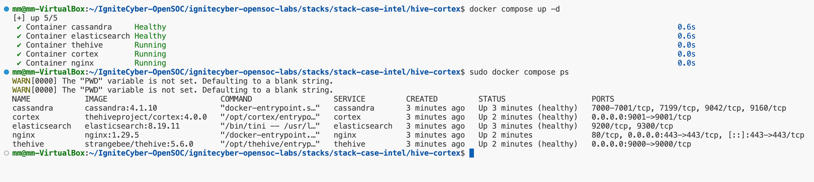

If you receive a permission denied error, run:

```bash
sudo chown root:docker /var/run/docker.sock && sudo chmod 660 /var/run/docker.sock
```

Then retry:

```bash
docker compose ps
```

If docker container for elssticsearch or cassandra fails:

```bash
sudo chown -R 1000:1000 .
sudo chmod -R 775 .
```

Then retry creating the containers


---

Navigate to the `misp-docker` directory:

```bash
cd misp-docker
```

Create the .env file:

```bash
cp template.env .env
```

Start the containers:

```bash
docker compose up -d
```

Reference Images:

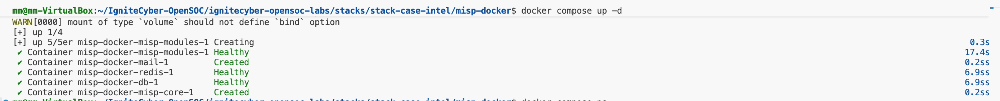

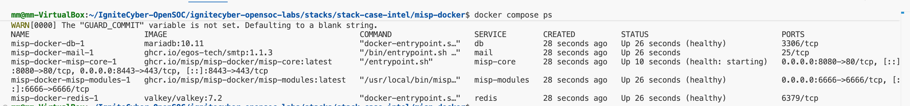

---

To access the web endpoints from your host machine, update the `/etc/hosts` file:

```bash
sudo nano /etc/hosts
```

Add the following line:

```
[VM_IP]    soc.lab
```

Replace `[VM_IP]` with your virtual machine’s IP address.

---

To access the web endpoints from your VM, update the `/etc/hosts` file:

```bash
sudo nano /etc/hosts
```

Add the following line:

```
127.0.0.1    soc.lab
```

---

#### Service URLs and Credentials

**TheHive**

- URL: http://soc.lab:9000/thehive  
- Username: admin@thehive.local  
- Password: secret  

**Cortex**

- URL: http://soc.lab:9001/cortex  
- Username: admin  
- Password: password  
(Cortex does not have default password. Accessing it for the first time might lead to the "Update Database" page. By clicking on it a user and password can be created)

**MISP**

- URL: https://soc.lab:8443/  
- Username: admin@admin.test  
- Password: admin 

---

#### Service Connections


**TheHive-Cortex Connection**

1. Create an organization IC_SOC in Cortex:
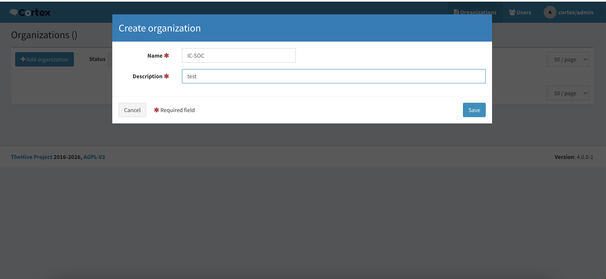


2. Create a user for the organization:
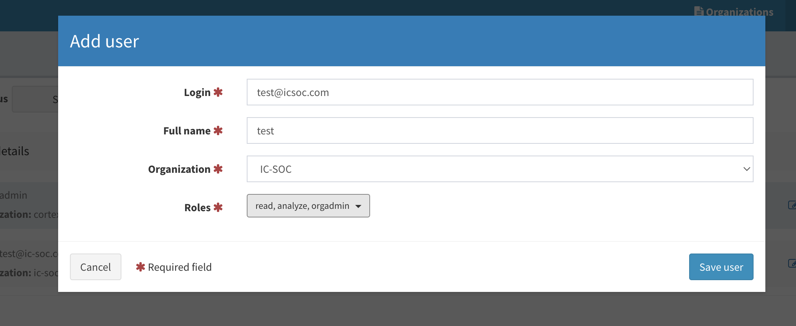
Copy this user's API key in TheHive for the Cortex server connection in step 4


3. Create the same organization in TheHive:
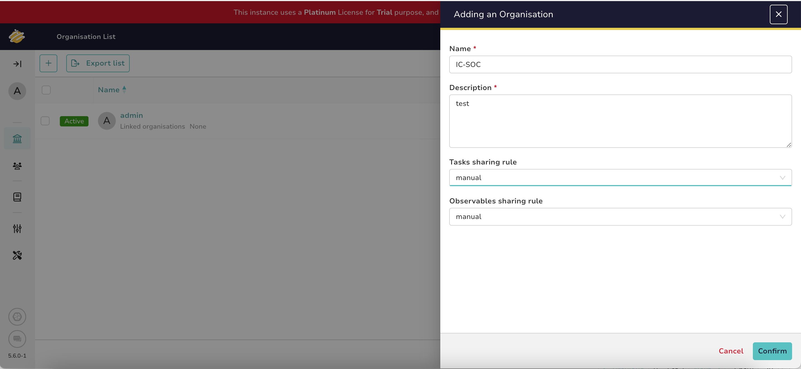


4. In TheHive's Platform-Management, go to the Connector tab and add a Cortex server with the following config:
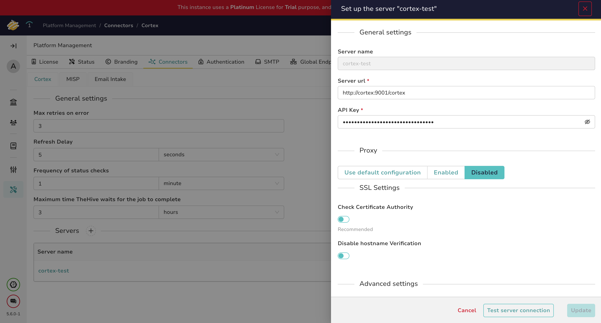
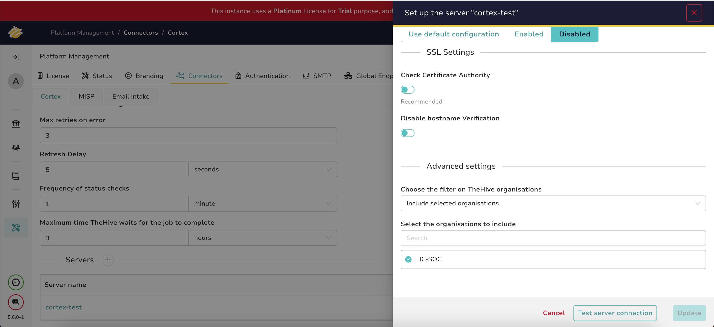


5. Test the connection. Once the connection is working, click on update and then click on confirm to save the changes.


**TheHive-MISP Connection**

1. In MISP go to My Profile and Auth keys and create a new auth key for the user:
Make sure to copy the key.
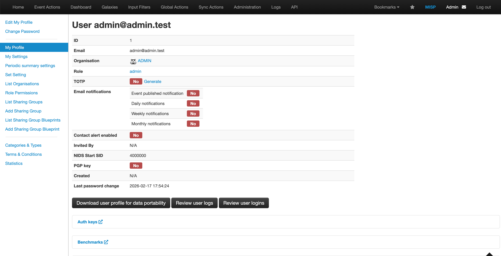
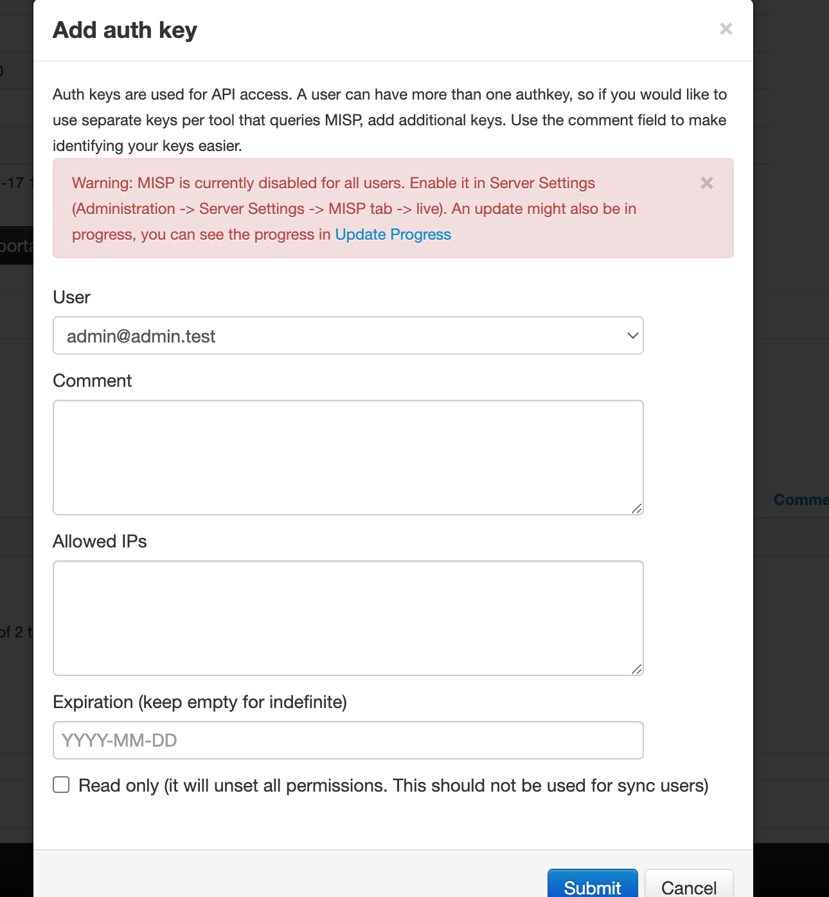


2. In Theive's Platform-Management, go to the Connector tab and add a MISP server with the following config and the API key from step 1:
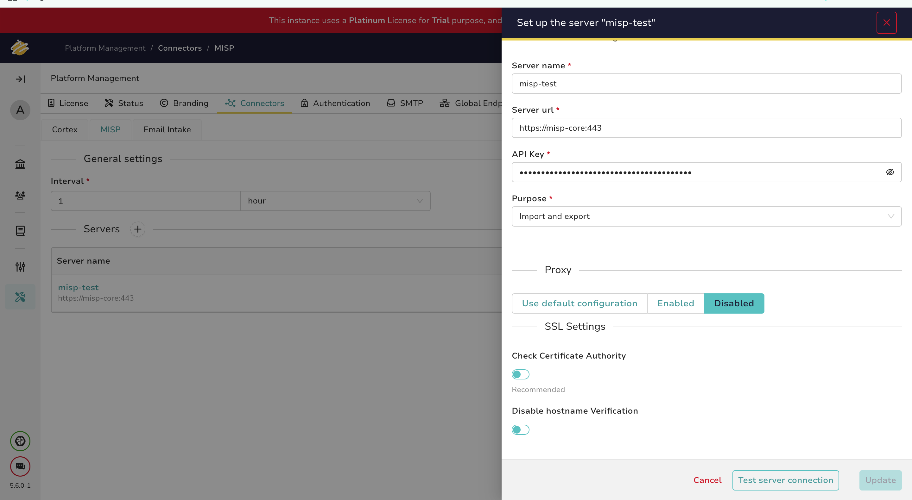
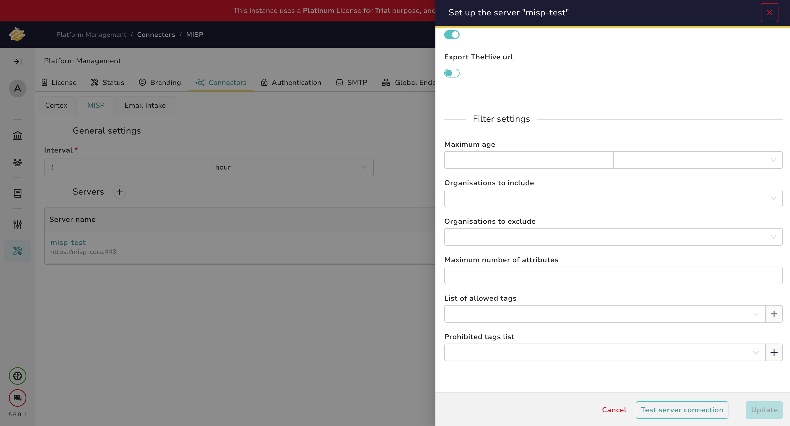


3. Test the connection. Once the connection is working, click on update and then click on confirm to save the changes.