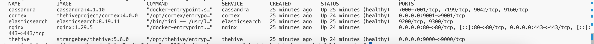
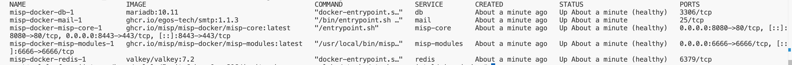
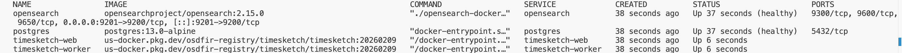
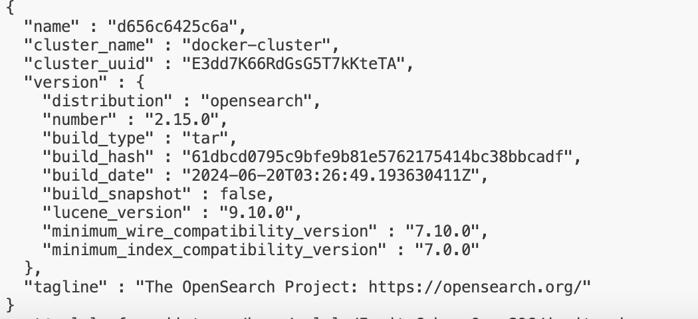
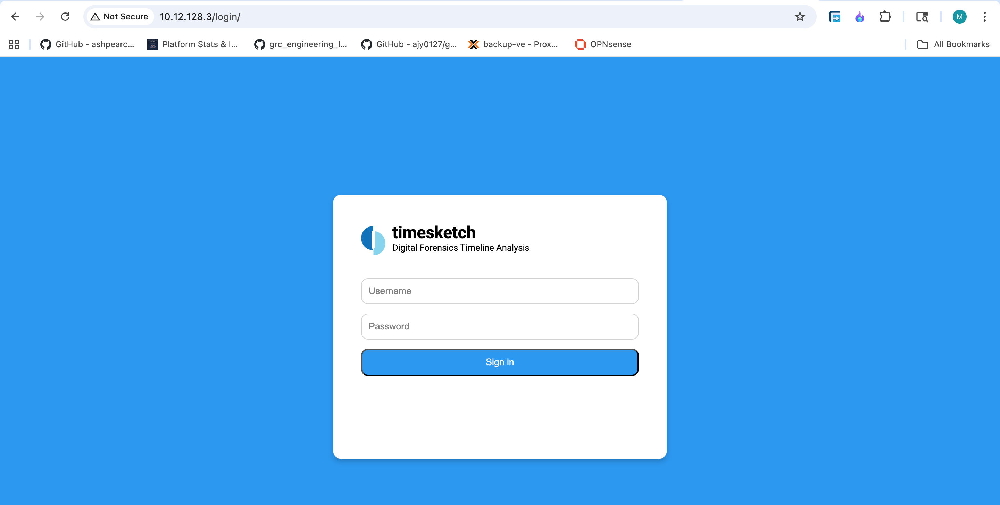

### Timesketch Setup Guide

Navigate to the `/stacks/stack-case-intel/hive-cortex` directory:
```bash
cd /stacks/stack-case-intel/hive-cortex
```

Restart thehive-cortex containers with the new config:
```bash
docker compose down
docker compose up -d
```

Verify the containers are running:
(Ensure that nginx is accessible on port 80 too: 0.0.0.0:80->80/tcp)

```bash
docker compose ps
```
Reference Image:



----
Navigate to the `/stacks/stack-case-intel/misp-docker/` directory and repeat the above steps to make sure the containers are running

Reference Image:


----


In the /stacks/stack-dfir-hunt folder, run the command to start the containers:

```bash
docker compose up -d
```

Verify the containers are running:

```bash
docker compose ps
```

Reference Image:



Verify that the opensearch container is reachable:

```bash
curl http://localhost:9201
```
Reference Image:




Create a user for timesketch (Replace <> with the credentials):

```bash
docker compose exec timesketch-web tsctl create-user <USER> --password <PASSWORD>
```

Access timesketch web interface, and login with the credentials in the above step:

If accessing on locahlhost: http://localhost:5000

If accessing on VM : http://[VM_IP]

Reference Image:


