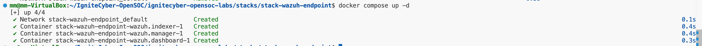

In the `stack-wazuh-endpoint` directory, generate the certificates using the command:

```bash
docker compose -f generate-indexer-certs.yml run --rm generator
```

Start the containers:

```bash
docker compose up -d
```

Reference Image:


---

#### Service URLs and Credentials

**Wazuh**

- URL: https://soc.lab:5601
- Username: admin 
- Password: SecretPassword  